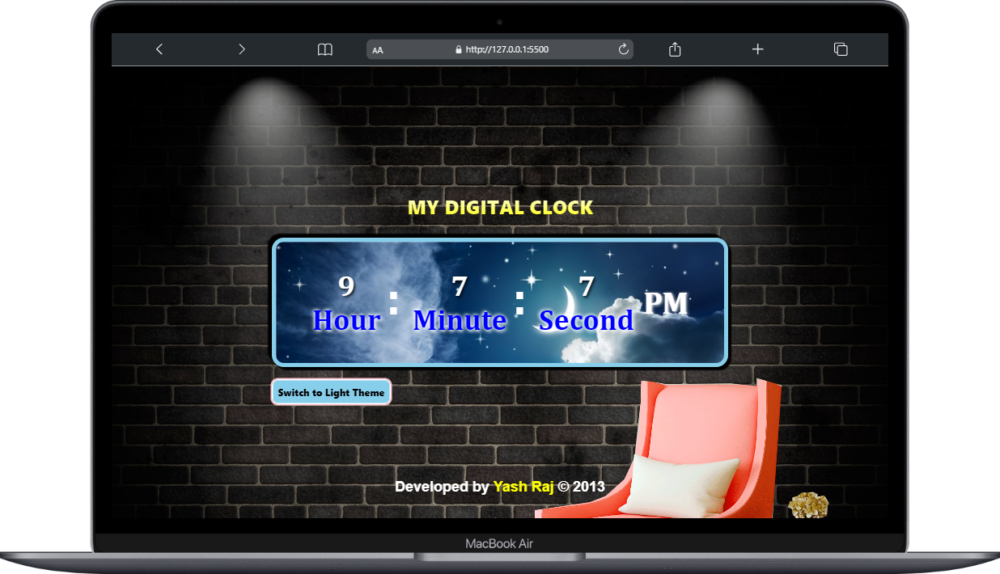
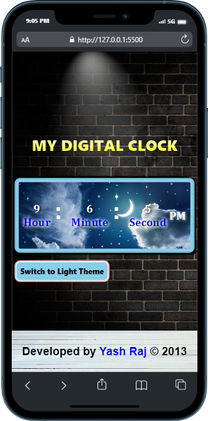
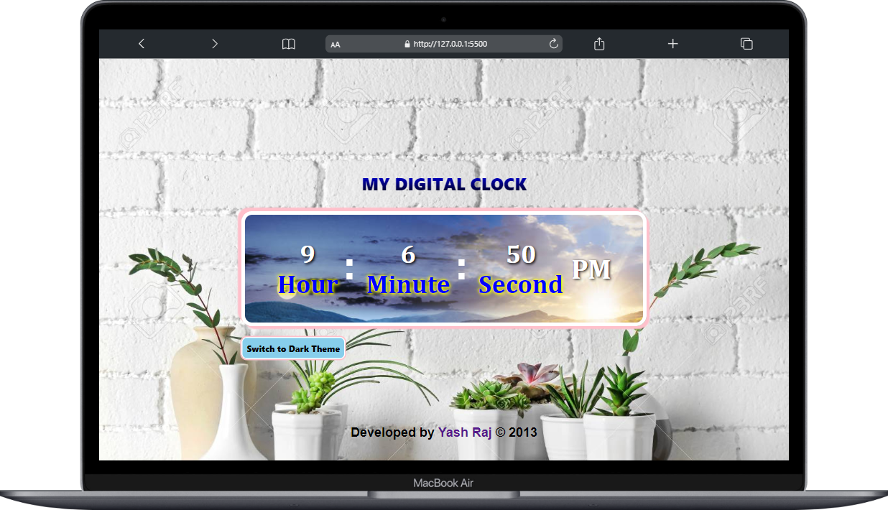

# <b>
DIGITAL CLOCK WITH DARK AND LIGHT THEME
This project is a simple fully responsive  digital clock website in which you can switch to dark mode and light mode.

## Getting Started and Features
----
To get started, simply open this link -> https://yashraj24october.github.io/Digital-Clock/
in your browser.

* The clock will automatically start running and display the current time in 12-hour format with AM/PM notation.

* You can switch between dark and light modes by clicking on the toggle button on the bottom-left of the screen. 
This will change the overall look of the clock and screen.

## Screenshots
-----
In Dark Theme 

In Light Theme 

## Project was developed with
 ----

